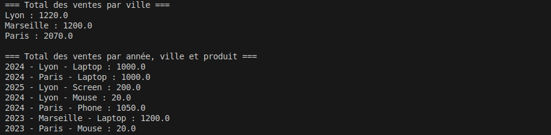
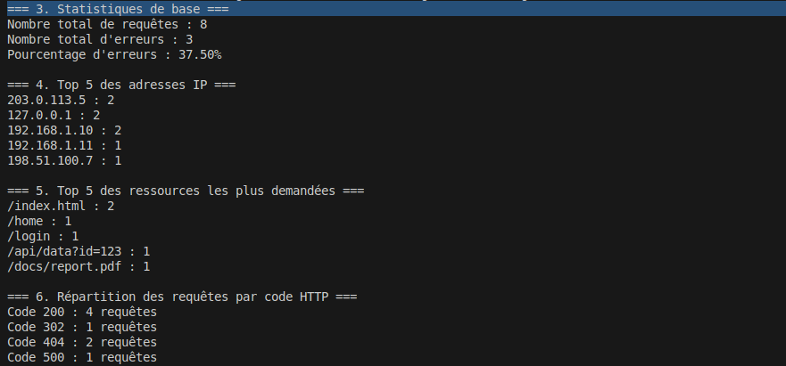

# TP Spark RDD - Analyse de Ventes et de Logs

Ce projet contient deux applications Spark développées en Java pour le traitement et l'analyse de données volumineuses via des RDDs.

---

## Exercice 1 : Analyse des Ventes (`Exo1.java`)

Cet exercice traite un fichier `ventes.txt` pour effectuer des agrégations financières.
Il calcule :
1. Le total des ventes par ville.
2. Le total des ventes par année, ville et produit.

---

## Exercice 2 : Analyse de Logs Web (`Exo2.java`)

Cet exercice analyse un fichier de logs serveur (`access.log`) pour extraire des métriques clés.
Il calcule :
1. Statistiques globales (nombre de requêtes, taux d'erreur).
2. Top 5 des adresses IP intenses.
3. Top 5 des ressources demandées.
4. Répartition des codes HTTP.

